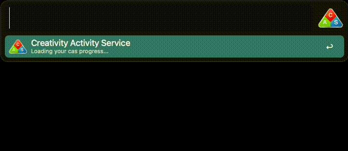
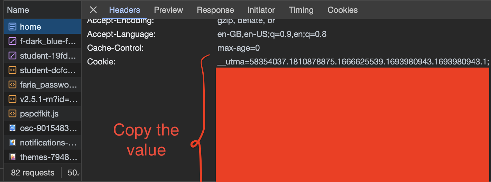
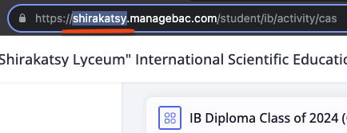

<h1>Managebac-Alfred-Workflow</h1>

An Alfred workflow to quickly access ManageBac platform

<h2>Command prompts</h2>
<ul>
<li><b>"Classes"</b> — shows your current classes.  Hold <b>cmd</b> to acces a quick summary of your performance </li>
<li><b>"Upcoming"</b> — outputs upcoming tasks in your agenda</li>
<li><b>"Cas"</b> — displays your recent cas experiences and their status</li>
<li><b>"Dashboard"</b> — transfers you to a ManageBac dashboard page on your default browser</li>
<li><b>"Timetables" — transfers you to a timetables page on your default browser</b></li>
</ul>

<h2>Quick setup</h2>
<h3>Install Python3</h3>

If you haven't got python on your mac machine, simply input <code>python3</code> in the terminal, and it should automatically prompt you to install it

<h3>Enter workflow variables</h3>

Workflow variables are:

<ul>
<li><code>Cookie</code> — required to perform ManageBac search. Can be acquired through your browser (Google Chrome is suggested)</li>
<li><code>School_domain</code> — name of your school. It's written in the url and stands between "https://" and ".managebac"</li>
</ul>

Firstly, visit the ManageBac page and use youre browsers developer tools. Right click on any website eleming and select "inspect". Select "Network" instead of "Elements" on the right window. Reload the website by either clicking on reload button or pressing F5 and find the first element in the "name" column. 
 

There you'll find a <code>cookie</code> variable. Copy it's value and pass it to the <code>cookie</code> string in Alfred.

After doing so you can proceed to input your school name into <code>school_domain</code> field

